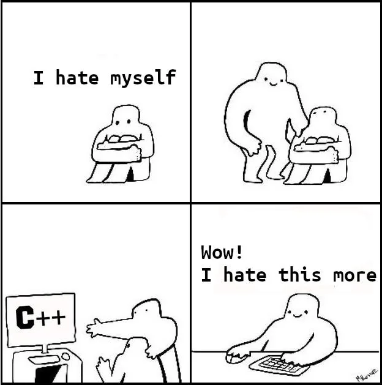

## Code review 19/09/25
> Review par Maël Lukas
### Résumé de la review
Pas de problèmes pour l'instant le code est carré. [Pokemon.cpp](./Pokedex.cpp) et [Pokemon.hpp](./Pokemon.h) sont codées proprement avec les petites fonctions de test dans le [main.cpp](./main.cpp) pour tout vérifier donc pas de soucis. 
<br> La review était assez courte, je sais pas si tu as avancé le code plus loin sans le push sur github ou si tu t'étais arrêtée là.

### Remarque
N'oublie pas quand tu définis ton constructeur Pokedex dans [Pokedex.hpp](./Pokedex.hpp) de faire en sorte qu'il hérite de *Pokemon_Vector* avec une petite modification de ce style: <br>
```
class Pokedex : public Pokemon_Vector { ... };
```


### Petit ajout sympatique
Comme il fallait ajouter une feature au code j'en ai profité pour faire le CSV reader qui lit [pokemon.csv](./pokemon.csv) ligne par ligne


